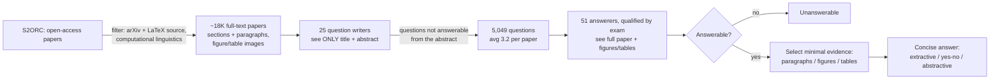
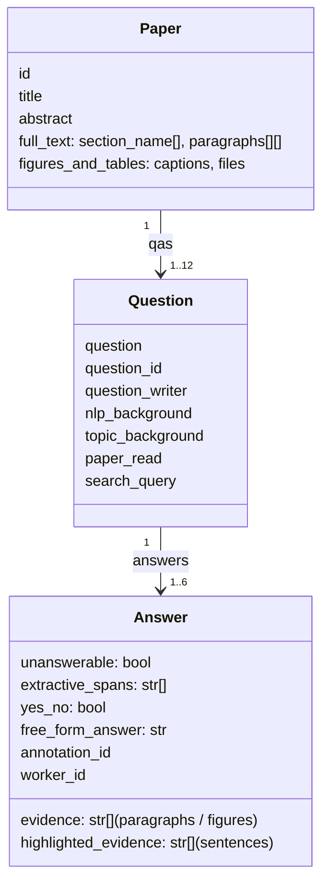
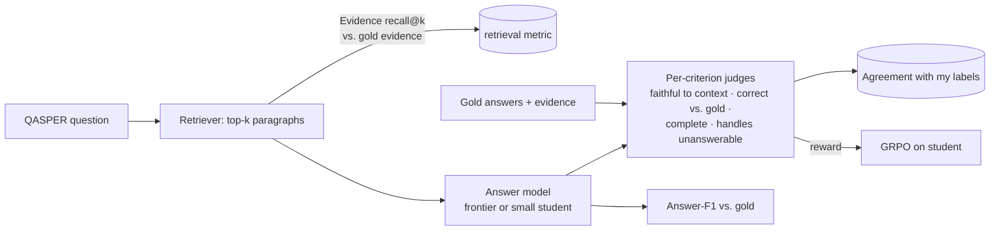

# QASPER: what it is, how it works, what it means for the project

Sources: Dasigi et al., *A Dataset of Information-Seeking Questions and Answers Anchored in Research
Papers*, NAACL 2021 ([arXiv:2105.03011](https://arxiv.org/abs/2105.03011)), cited as **§section / Table n**;
dataset card [allenai/qasper](https://huggingface.co/datasets/allenai/qasper), cited as **[card]**.

## Summary
QASPER is a question-answering dataset over full NLP research papers: 5,049 questions on 1,585 papers
(§1). It was built to be realistic: one group of people wrote questions after reading only a paper's
title and abstract, and a separate group answered them from the full text and marked the evidence
(§2.2). So questions reflect real curiosity, not text the writer was looking at. Answers can be
extracted spans, free-form text, yes/no, or "unanswerable" (Table 1). The paper's best model trailed
humans by 27 Answer-F1 points (§1). For us it supplies grounded questions, gold evidence, and multiple
human answers — the raw material for a judge, and for training a small model to answer faithfully.

## How it was built

- Papers: filtered from S2ORC to arXiv papers with LaTeX source in computational linguistics. LaTeX
  avoids PDF-parsing errors (§2.1).
- Annotators: NLP grad students and freelancers, paid ~$25/hour, per hour rather than per question to
  favor quality (§2.2). Answerers passed tutorials and a qualification exam (§2.2).
- The split between question writers and answerers is the key design choice: question writers never saw
  the answer text, so questions don't copy the paper's wording (§2.2).

## What one record looks like

Field names are from [card]. A question has 1.6 answers on average, up to 6 (§3).

## Key statistics

| What | Value | Source |
|---|---|---|
| Splits (paper-disjoint) | train 2,593 q / 888 papers · dev 1,005 / 281 · test 1,451 / 416 | §4.1, [card] |
| Questions with ≥2 answers | 44% overall; **98% of test**, 74% of dev | §3, §4.1 |
| Answer types | extractive 51.8% · abstractive 24.2% · yes/no 13.9% · unanswerable 10.2% | Table 1 |
| Evidence types | text 81.6% · table/figure 11.6% · none 12.8% | Table 1 |
| Multi-paragraph evidence | 55.5% of answerable text-evidence questions | §3 |
| Paper-specific (vs. generic) questions | 67% | §3 |
| Agreement on answerability | 90% | §3 |
| Agreement on evidence type (text vs. figure) | 84% | §3 |
| **Answers judged correct** (100 sampled questions) | **75.8%**; 98% of questions had ≥1 correct answer | §3 |
| License | CC BY 4.0 | [card] |

## How it is scored

- **Answer-F1**: token-overlap F1 (SQuAD style). Multiple spans are joined with commas; with several
  reference answers, the score is the **max** over references (§4.1).
- **Evidence-F1**: F1 over the set of selected paragraphs/figures/tables vs. gold evidence, max over
  references (§4.1).
- **Human lower bound**: score each human answer against the others → 60.9 Answer-F1, 71.6 Evidence-F1
  (§4.1). Called a lower bound because the human is compared to fewer references than a model is.

Results (test, Answer-F1; Tables 2–4):

| System | Extractive | Abstractive | Yes/No | Unanswerable | Overall |
|---|---|---|---|---|---|
| LED-base, question only | 5.9 | 7.4 | 66.4 | 66.7 | 22.5 |
| LED-base, full paper | 31.0 | 15.8 | 70.3 | 26.2 | 32.8 |
| Human lower bound | 58.9 | 39.7 | 79.0 | 69.4 | 60.9 |
| Oracle: LED-base / UnifiedQA-large given **gold evidence** (Table 4) | — | — | — | — | 45.0 / 61.4 |

Evidence selection (test Evidence-F1, Table 3): TF-IDF 9.2, LED-large 39.4, human 71.6.

## What it means for our project

1. **Token F1 can't tell when two answers mean the same thing; a judge can.** Even the human lower bound on abstractive answers is
   39.7 F1 (Table 2): two correct paraphrases score low. That gap is the case for an LLM judge.
   Keep Answer-F1 as a cheap deterministic metric alongside it.
2. **Gold answers are noisy.** Only 75.8% of individual answers were correct (§3). The judge should check
   against the *evidence*, not only string-match the gold answer, and the test set is where my labels fix
   this.
3. **Finding the right paragraphs is the bottleneck.** Given gold evidence, the same LED-base rises from
   33.6 to 45.0 Answer-F1, and UnifiedQA-large reaches 61.4 (Table 4 vs. Table 2; the paper concludes most
   of the headroom is evidence selection, §5.2). Since we
   chose retrieve-then-answer, measure retrieval recall of gold evidence before blaming the answer model.
   55.5% of questions need several paragraphs (§3), so k must be big enough to cover them.
4. **"Unanswerable" is a reward-hacking risk.** A model that sees only the question scores 66.7 on
   unanswerable questions (Table 2). Under GRPO, a student can learn to say "unanswerable" when unsure.
   The rubric needs a completeness criterion, and we track the unanswerable rate during training.
5. **Text-only subset.** 13% of questions need tables or figures (§1); the paper excluded them (§5). We
   should too — no image input for a small student.
6. **Contamination.** The papers are from arXiv up to ~2020 (S2ORC releases, §2.1), almost certainly in
   modern models' pretraining. A question-only (closed-book) baseline tells us how much is memorized.
7. **Human agreement is already in the data.** The test set has 98% multi-reference questions; scoring one
   human against the others is our human-vs-human reference point, complementing my own re-label κ.

## Decision log

| Decision | Options considered | Chosen | Why | Revisit if |
|---|---|---|---|---|
| Dataset | merchant-analytics agent, BIRD text-to-SQL, HelpSteer, QASPER | QASPER | Neutral domain, grounded evidence, multi-reference answers, CC BY 4.0 | We want a multi-step tool-calling agent → BIRD |
| Input | full paper (~thousands of tokens), retrieved top-k | retrieved top-k | Keeps student inference and GRPO cheap | Retrieval recall@k too low to measure answer quality |
| Evidence scope | all questions, text-only | text-only (proposed) | Small student has no image input; matches §5 | Move to a multimodal student |
| Metric | Answer-F1 only, judge only | both | F1 is free and deterministic; judge handles paraphrase and faithfulness | — |
| Gold labels | trust gold, re-label | my labels on test set; gold as a signal | 24% of gold answers are wrong (§3) | — |

## Cost & risk
- Data is small (~5K questions) and free; download is trivial on the laptop.
- Retrieval adds a component that can fail silently → log recall@k on every run.
- Risks: contamination inflates scores; "unanswerable" shortcut under GRPO; noisy gold answers bias
  reference-based judges; dataset is limited to NLP papers up to ~2020, so domain claims stay narrow.

## Open questions
1. Exclude table/figure questions (recommended), or keep them as an "unanswerable from text" probe?
2. Retriever: BM25 baseline first (cheap, laptop), then embeddings — and what k?
3. Train from QASPER train split only, or also generate synthetic questions on newer papers to reduce
   contamination?
