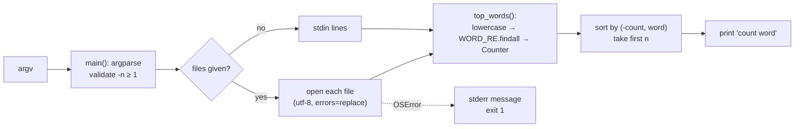

# Explainer — `wordfreq` CLI (loop smoke test)

## Summary
A small CLI that prints the N most frequent words from files or stdin. It exists to test the
Build → Explainer → Reviewer → Demo loop end to end, not to be a product. It streams input line by
line, counts case-insensitively, and breaks ties alphabetically so output is deterministic.

## How it works

- Tokenizing: `WORD_RE` keeps alphanumerics and one internal apostrophe (`don't`) (`wordfreq.py:10`).
- Ranking: `sorted(..., key=(-count, word))` (`wordfreq.py:16`).
- Input: `lines()` is a generator, so files are never loaded whole (`wordfreq.py:27`).
- Errors: an unreadable file prints a clean error and exits 1 (`wordfreq.py:37-39`); bad `-n` exits 2 via
  argparse (`wordfreq.py:25`).

## Decision log
| Decision | Options considered | Chosen | Why |
|---|---|---|---|
| Tie-breaking | `Counter.most_common` (insertion order) vs. explicit sort | Explicit `(-count, word)` sort | Deterministic output; testable |
| Tokenizer | `str.split`, `\w+`, custom regex | `[a-z0-9]+(?:'[a-z]+)?` | Strips punctuation, keeps contractions. ASCII-only is a known limitation |
| Reading input | Read whole file vs. stream lines | Stream via generator | Constant memory in file size |
| Type hints on Python 3.8 | Drop hints vs. `typing.List` vs. `from __future__ import annotations` | `__future__` import | The default `python3` here is 3.8; keeps modern syntax |
| Tests | Unit-test `top_words` vs. drive the CLI | Drive the CLI via subprocess | Tests behavior users see, including exit codes and stderr |

## Cost & risk
No infra cost. Memory is O(unique words). Risk: the ASCII-only regex drops non-English words.
That's acceptable for a smoke test; fix it before any real use.

## Open questions
None. This is a throwaway example.
