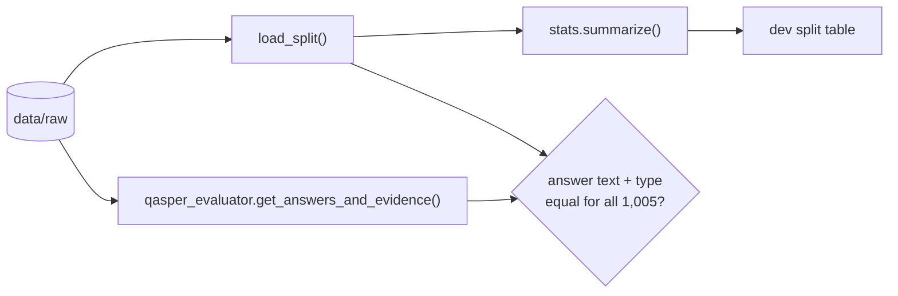

# M0, part 3: verification on the real dev split

**PR:** [reflective-qa#4](https://github.com/bhavya94/reflective-qa/pull/4) (Stack 3/3) · **Code at:** [`0c074ec`](https://github.com/bhavya94/reflective-qa/tree/0c074ecdd2fdcab9631199739ba5cc54da2c924f)

## Summary
The loader in [#3](https://github.com/bhavya94/reflective-qa/pull/3) is tested on a hand-written fixture. This PR checks it against the real data. It adds a
one-command summary of the dev split, and a test that the loader's answer text and types equal the
official evaluator's on all 1,005 dev questions. That closes M0: the data layer that M1's retrieval and
answer-F1 build on.

## How it works

- `summarize()` ([`src/reflective_qa/stats.py:11`](https://github.com/bhavya94/reflective-qa/blob/0c074ecdd2fdcab9631199739ba5cc54da2c924f/src/reflective_qa/stats.py#L11)) counts papers, questions, answer types and evidence
  coverage. Every number in the table below comes from it.
- The parity test ([`tests/test_evaluator_parity.py:20`](https://github.com/bhavya94/reflective-qa/blob/0c074ecdd2fdcab9631199739ba5cc54da2c924f/tests/test_evaluator_parity.py#L20)) imports the downloaded official evaluator and
  compares its parsed answers with ours. It is skipped when the data isn't downloaded ([`test_evaluator_parity.py:15`](https://github.com/bhavya94/reflective-qa/blob/0c074ecdd2fdcab9631199739ba5cc54da2c924f/tests/test_evaluator_parity.py#L15)), so the suite
  still passes on a fresh clone.

| Dev split | Value |
|---|---|
| Papers / questions | 281 / 1,005 |
| Text-only questions | 841 (616 with ≥2 answers) |
| Answers by type (text-only) | extractive 888 · abstractive 262 · boolean 173 · unanswerable 143 |
| Evidence mapped to paragraphs / section headings | 2,154 / 124 |
| Paragraphs per paper · characters per paragraph (medians) | 43 · 415 |

## Files

| File | Why |
|---|---|
| `src/reflective_qa/stats.py` | One command to check the loader on real data |
| `tests/test_evaluator_parity.py` | Makes "matches the official evaluator" a repeatable test instead of a one-off check |
| `README.md` | Adds the stats command; marks M0 done |

## Decision log

| Decision | Options considered | Chosen | Why | Revisit if |
|---|---|---|---|---|
| Parity test data | Commit a dev sample; use the downloaded files and skip if absent | Downloaded files, skip if absent | No QASPER data in the repo; the full dev set is a stronger check than a sample | CI is added; it would then run the download first |

## Cost & risk
No model calls. The full test suite, parity test included, runs in about 0.3 s.

## Open questions (for M1)
1. **Model access:** an Anthropic API key (recommended), or `claude -p` on the Max plan. Routing calls
   through Max credentials isn't allowed by Anthropic's credential policy.
2. **Weak writer model:** Haiku 5.5 ($0.10 / $0.50 per million input / output tokens) made "weak" with
   fewer passages, instead of Haiku 4.5 ($1 / $5).
3. **Retrieval depth k:** chosen in M1 from evidence recall@k on the 2,154 mapped evidence paragraphs.
