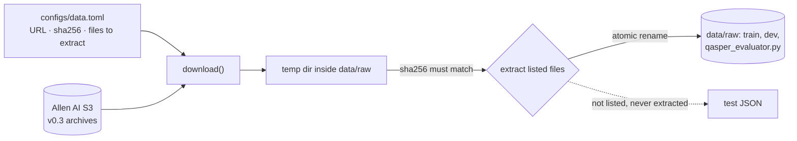

# M0, part 1: project setup and verified QASPER download

**PR:** [reflective-qa#2](https://github.com/bhavya94/reflective-qa/pull/2) (Stack 1/3) · **Code at:** [`d4fa7c2`](https://github.com/bhavya94/reflective-qa/tree/d4fa7c21119182a631acbafe8fc0ce3765d5af0f)

## Summary
Every later milestone needs the same QASPER data on any machine, and the test split must stay unused until
the final evaluation. This PR adds the project skeleton and a download that verifies each archive's SHA-256
and extracts only the files the config lists. Only the official evaluator is taken from the test archive,
so the test questions never land on disk.

## How it works

- Files already present are skipped before any network call ([`src/reflective_qa/download.py:21-22`](https://github.com/bhavya94/reflective-qa/blob/d4fa7c21119182a631acbafe8fc0ce3765d5af0f/src/reflective_qa/download.py#L21-L22)).
- The archive is fetched into a temp dir inside `data/raw` ([`download.py:24-27`](https://github.com/bhavya94/reflective-qa/blob/d4fa7c21119182a631acbafe8fc0ce3765d5af0f/src/reflective_qa/download.py#L24-L27)), checked against the config
  ([`download.py:28-30`](https://github.com/bhavya94/reflective-qa/blob/d4fa7c21119182a631acbafe8fc0ce3765d5af0f/src/reflective_qa/download.py#L28-L30)), and only listed members are extracted with `filter="data"` ([`download.py:32`](https://github.com/bhavya94/reflective-qa/blob/d4fa7c21119182a631acbafe8fc0ce3765d5af0f/src/reflective_qa/download.py#L32)). Each file is then
  renamed into place ([`download.py:34`](https://github.com/bhavya94/reflective-qa/blob/d4fa7c21119182a631acbafe8fc0ce3765d5af0f/src/reflective_qa/download.py#L34)), so an interrupted run leaves no partial file.
- Config paths are relative to the config file ([`download.py:18`](https://github.com/bhavya94/reflective-qa/blob/d4fa7c21119182a631acbafe8fc0ce3765d5af0f/src/reflective_qa/download.py#L18)), so the command works from any directory.

## Files

| File | Why |
|---|---|
| `src/reflective_qa/download.py` | The download described above |
| `configs/data.toml` | Sources and checksums live in config, not code. The second archive's `extract` list ([`data.toml:14`](https://github.com/bhavya94/reflective-qa/blob/d4fa7c21119182a631acbafe8fc0ce3765d5af0f/configs/data.toml#L14)) is what keeps the test split off disk |
| `tests/test_download.py` | Uses local `file://` archives to prove only listed files are extracted and a bad checksum writes nothing ([`test_download.py:31-43`](https://github.com/bhavya94/reflective-qa/blob/d4fa7c21119182a631acbafe8fc0ce3765d5af0f/tests/test_download.py#L31-L43)) |
| `pyproject.toml`, `uv.lock`, `.python-version` | Python 3.12 with no runtime dependencies (`tomllib`, `tarfile`, `urllib` suffice); pytest pinned for development |
| `.gitignore` | Keeps downloaded data, `.env` and `.venv` out of git |
| `README.md`, `src/reflective_qa/__init__.py`, `py.typed` | Project front page; package marker; PEP 561 typing marker generated by `uv init --lib` |

## Decision log

| Decision | Options considered | Chosen | Why | Revisit if |
|---|---|---|---|---|
| Data source | HF `datasets` loader, HF Parquet conversion, original S3 release | S3 v0.3 archives | The HF loading script no longer runs in current `datasets`; S3 has the exact files the official evaluator expects and is checksummable | Allen AI retires the bucket |
| Test split | Download it and promise not to read it; never extract it | Never extract | Makes "test untouched" structural rather than a promise | Final evaluation at the end of Track A |
| Dependencies | `requests`, `datasets`, standard library | Standard library | Nothing to pin or audit yet | M1 adds the Anthropic SDK and a BM25 library |

## Cost & risk
- No model calls. About 15 MB downloaded.
- If the S3 files change or disappear, the checksum check fails loudly rather than loading different data.
- Rollback: delete `data/`; `uv run python -m reflective_qa.download` rebuilds it.

## Open questions
None for this PR.
