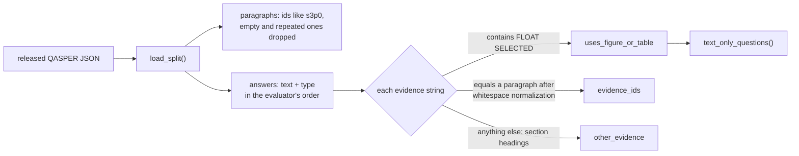

# M0, part 2: typed QASPER loader

**PR:** [reflective-qa#3](https://github.com/bhavya94/reflective-qa/pull/3) (Stack 2/3) · **Code at:** [`c3cf848`](https://github.com/bhavya94/reflective-qa/tree/c3cf84813655c8da6e376ed3ed0e31aeb5816188)

## Summary
Later milestones score answers with QASPER's answer-F1 and measure whether retrieval finds the gold
evidence. Both are only correct if answers are parsed exactly as the official evaluator parses them, and if
gold evidence maps onto the same paragraphs a retriever returns. This PR adds typed records and
`load_split`, which does both, plus the text-only filter that defines the working set: 841 of 1,005 dev
questions.

## How it works

- **Answers** ([`src/reflective_qa/data.py:130-140`](https://github.com/bhavya94/reflective-qa/blob/c3cf84813655c8da6e376ed3ed0e31aeb5816188/src/reflective_qa/data.py#L130-L140)): unanswerable → extractive spans joined with ", " →
  free-form → yes/no, the evaluator's order. Unanswerable becomes the literal `"Unanswerable"` ([`data.py:14`](https://github.com/bhavya94/reflective-qa/blob/c3cf84813655c8da6e376ed3ed0e31aeb5816188/src/reflective_qa/data.py#L14)),
  which is what answer-F1 compares against.
- **Paragraphs** ([`data.py:80-90`](https://github.com/bhavya94/reflective-qa/blob/c3cf84813655c8da6e376ed3ed0e31aeb5816188/src/reflective_qa/data.py#L80-L90)): empty paragraphs and repeats of an earlier paragraph are skipped, so every
  evidence text has exactly one ID to retrieve. IDs keep their original positions.
- **Evidence** ([`data.py:109-120`](https://github.com/bhavya94/reflective-qa/blob/c3cf84813655c8da6e376ed3ed0e31aeb5816188/src/reflective_qa/data.py#L109-L120)): figure or table evidence sets a flag; text evidence maps to a paragraph ID
  after collapsing whitespace; anything else goes to `other_evidence`.
- **Text-only** ([`data.py:52-54`](https://github.com/bhavya94/reflective-qa/blob/c3cf84813655c8da6e376ed3ed0e31aeb5816188/src/reflective_qa/data.py#L52-L54), [`data.py:72-73`](https://github.com/bhavya94/reflective-qa/blob/c3cf84813655c8da6e376ed3ed0e31aeb5816188/src/reflective_qa/data.py#L72-L73)): a question is dropped if any annotator needed a figure or table.

## Files

| File | Why |
|---|---|
| `src/reflective_qa/data.py` | The records and parsing described above |
| `tests/fixtures/mini_qasper.json` | One hand-written paper containing every edge case found in the real data: each answer type, an empty and a repeated paragraph, whitespace-mismatched evidence, a heading that also appears inside a paragraph, figure evidence |
| `tests/test_data.py` | Six behavior tests on the fixture. Three of them fail on an earlier draft of the loader, so they guard real bugs |

## Decision log

| Decision | Options considered | Chosen | Why | Revisit if |
|---|---|---|---|---|
| Answer parsing | Own rules; the evaluator's | The evaluator's order | Our answer-F1 must equal the official one. [#4](https://github.com/bhavya94/reflective-qa/pull/4) checks this on all 1,005 dev questions | — |
| Evidence matching | Exact; whitespace-normalized; "paragraph containing it" fallback | Whitespace-normalized exact match | Exact matching missed 77 strings that differ only in whitespace. The other 129 misses on dev are section headings, which no paragraph retriever can return, so they're kept out of recall rather than counted as misses. A containment fallback was tried and removed: on dev and train it only ever matched headings, to the wrong paragraph | A dataset with sentence-level evidence |
| Repeated paragraphs | Keep all copies; keep the first | Keep the first | Dev has 73 repeats (e.g. "Attention only: 1"). With copies, a retriever returning the "other" copy would count as a miss | — |
| Text-only rule | Drop if any answer uses a figure or table; only if all do | Any | A question one annotator needed a table for may not be answerable from text | We want an "unanswerable from text" probe |

## Cost & risk
- No model calls; loading the dev split takes about 0.2 s on an M1.
- About 24% of individual gold answers are wrong (QASPER paper, §3), so answer-F1 is a signal, not
  ground truth, until M2's labels exist.
- The official evaluator scores questions with no prediction as 0. M1 must score against a gold file
  filtered to the same 841 questions.

## Open questions
None for this PR.
