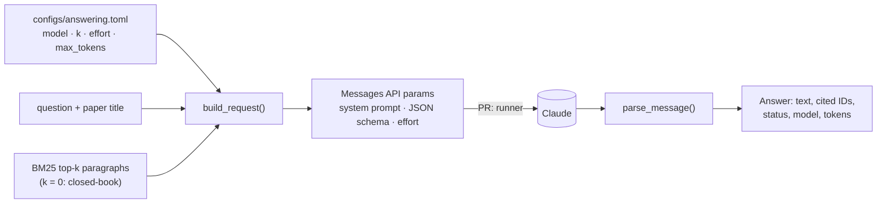

# M1: answer prompt, request builder and reply parsing

**PR:** [reflective-qa#8](https://github.com/bhavya94/reflective-qa/pull/8) · **Code at:** [`7aeabb3`](https://github.com/bhavya94/reflective-qa/tree/7aeabb34a5e38f73fd7a15b1a4fd59de62c8afa1)

## Summary
The baselines need one fixed way to ask a model a question and read its answer. This PR builds the request:
the paper title, the retrieved paragraphs labeled with their IDs, and the question. The model must reply in
JSON with a short answer and the IDs of the paragraphs it used. Three run configs cover the M1 baselines:
Sonnet 5.5 with 20 paragraphs, Sonnet 5.5 with no paragraphs (closed-book), and Haiku 5.5 with 5 paragraphs.
The PR makes no model calls.

## In plain words
1. **The prompt** tells the model to use only the given paragraphs, to keep answers short, to copy a phrase
   when one answers the question, to say "Yes" or "No" for yes/no questions, and to say "Unanswerable" when the
   paragraphs don't hold the answer.
2. **Closed-book** gives no paragraphs and asks for a best guess. It measures what the model already knows about
   these 2020-era papers. If its score is high, the other runs partly measure memory, not reading.
3. **Structured output** forces the reply into `{"answer": ..., "evidence": [...]}`, so parsing never guesses.
4. **Weak writer:** Haiku 5.5 sees only 5 paragraphs, so it makes more mistakes for M2's error analysis to study.

## How it works

- **Prompt** ([`src/reflective_qa/answering.py:14-21`](https://github.com/bhavya94/reflective-qa/blob/7aeabb34a5e38f73fd7a15b1a4fd59de62c8afa1/src/reflective_qa/answering.py#L14-L21)) and **reply schema** ([`answering.py:23-28`](https://github.com/bhavya94/reflective-qa/blob/7aeabb34a5e38f73fd7a15b1a4fd59de62c8afa1/src/reflective_qa/answering.py#L23-L28)).
- **Request** ([`answering.py:58-70`](https://github.com/bhavya94/reflective-qa/blob/7aeabb34a5e38f73fd7a15b1a4fd59de62c8afa1/src/reflective_qa/answering.py#L58-L70)): passages are written as `[s3p0] Section. text`, using the same `passage_text` the
  retriever indexes. The same dict works for a direct call and for a Batch API request.
- **Parsing** ([`answering.py:73-83`](https://github.com/bhavya94/reflective-qa/blob/7aeabb34a5e38f73fd7a15b1a4fd59de62c8afa1/src/reflective_qa/answering.py#L73-L83)): a refusal or a reply cut off at `max_tokens` becomes an empty answer with that
  reason, checked before reading any content. A reply that isn't valid JSON is marked `invalid_json`. Cited IDs
  are kept as written, so scoring counts a made-up ID as a wrong citation.

## Files

| File | Why |
|---|---|
| `src/reflective_qa/answering.py` | The prompt, request builder and reply parser |
| `configs/answering.toml` | The three runs, and `max_tokens` |
| `tests/test_answering.py` | Passage labels, closed-book, parsing of normal, refused, truncated and malformed replies |
| `pyproject.toml`, `uv.lock` | Adds the `anthropic` SDK |

## Decision log

| Decision | Options considered | Chosen | Why | Revisit if |
|---|---|---|---|---|
| Reply format | Free text; JSON by instruction; structured output | Structured output (`output_config.format`) | Guarantees valid JSON, so no answer is lost to formatting | — |
| Closed-book instruction | Same rules ("Unanswerable" if unsure); best guess | Best guess | Its job is to measure memorized knowledge. With the abstain rule it would mostly measure abstention. Raised in review | — |
| Effort | Model defaults (high on Sonnet 5.5, medium on Haiku 5.5); explicit | `medium` for both, set explicitly | Same setting on both models, so the difference between runs is the model and k. Short extractive answers rarely need more | The pilot shows long reasoning or weak answers |
| `max_tokens` | 4,000; 16,000 | 16,000 | Thinking counts toward it, and a cut-off reply scores 0. Billing is per generated token, so headroom is free. Raised in review | — |
| Weak writer | Haiku 4.5 ($1 / $5); Haiku 5.5 ($0.10 / $0.50) with fewer paragraphs | Haiku 5.5, k = 5 | 10× cheaper; weakness comes from less context. Decided by Bhavya 2026-10-10 | — |

## Cost & risk
- No model calls in this PR. Input size per question, counted free: about 4,400 tokens for Sonnet with 20
  paragraphs, 500 closed-book, and 1,400 for Haiku with 5.
- Neither model accepts a custom temperature, so answers vary slightly between runs.
- The papers date from about 2020 and are likely in the models' training data. Closed-book measures how much.

## Open questions
None for this PR.
