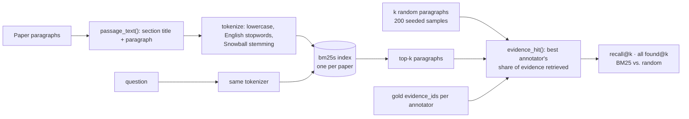

# M1, part 1: BM25 retrieval and evidence recall@k

**PR:** [reflective-qa#6](https://github.com/bhavya94/reflective-qa/pull/6) · **Code at:** [`7bbae4e`](https://github.com/bhavya94/reflective-qa/tree/7bbae4e2a2109b8325693960958dcf26f3c21221)

## Summary
The answer model will see only paragraphs retrieved from a paper, not the whole paper, so retrieval sets a
ceiling on answer quality. The QASPER paper found that picking the right evidence is where most of the
headroom is. This PR adds BM25 retrieval over one paper's paragraphs and measures how much of the
annotators' gold evidence the top-k contains. On the 759 dev questions with paragraph evidence, the top 20
paragraphs contain 90% of gold evidence, against 58% for 20 random paragraphs, in about 11,700 characters.
Part 2 will use k = 20.

## How it works

- **Passages** ([`src/reflective_qa/retrieval.py:15-18`](https://github.com/bhavya94/reflective-qa/blob/7bbae4e2a2109b8325693960958dcf26f3c21221/src/reflective_qa/retrieval.py#L15-L18)): each paragraph is indexed with its section title in
  front (`"Experiments. Datasets. We use…"`), because titles carry topic words the paragraph often doesn't
  repeat. The same `passage_text` will be what the answer model sees, so the context sizes below are real.
- **Tokenizing** ([`retrieval.py:9-12`](https://github.com/bhavya94/reflective-qa/blob/7bbae4e2a2109b8325693960958dcf26f3c21221/src/reflective_qa/retrieval.py#L9-L12)): question and paragraphs share one tokenizer. Each call creates its own stemmer,
  because PyStemmer instances must not be shared across threads, and part 2 will call models concurrently.
- **Retrieval** ([`retrieval.py:27-34`](https://github.com/bhavya94/reflective-qa/blob/7bbae4e2a2109b8325693960958dcf26f3c21221/src/reflective_qa/retrieval.py#L27-L34)): k is capped at the paper's paragraph count, because `bm25s` raises an error when
  k exceeds the corpus size.
- **Scoring** ([`src/reflective_qa/retrieval_eval.py:24-33`](https://github.com/bhavya94/reflective-qa/blob/7bbae4e2a2109b8325693960958dcf26f3c21221/src/reflective_qa/retrieval_eval.py#L24-L33)): each annotator's evidence is scored separately
  and the best kept, as the official evaluator does with answers. Questions where no annotator cited a
  paragraph (unanswerable, or heading-only evidence) are not scored.
- **Random baseline** ([`retrieval_eval.py:49`](https://github.com/bhavya94/reflective-qa/blob/7bbae4e2a2109b8325693960958dcf26f3c21221/src/reflective_qa/retrieval_eval.py#L49)): k paragraphs drawn at random, 200 seeded draws per question, scored with the
  same `evidence_hit`, so the baseline also gets the best annotator.

## Results (dev, `python -m reflective_qa.retrieval_eval`)

| k | Recall | All evidence found | Random recall | Random all found | Context (median characters) |
|---|---|---|---|---|---|
| 1 | 0.20 | 0.18 | 0.03 | 0.02 | 541 |
| 3 | 0.43 | 0.38 | 0.10 | 0.07 | 1,800 |
| 5 | 0.58 | 0.52 | 0.16 | 0.12 | 3,098 |
| 10 | 0.76 | 0.70 | 0.32 | 0.25 | 6,240 |
| 20 | 0.90 | 0.85 | 0.58 | 0.50 | 11,672 |

## Files

| File | Why |
|---|---|
| `src/reflective_qa/retrieval.py` | The retriever, one BM25 index per paper, and `passage_text` |
| `src/reflective_qa/retrieval_eval.py` | Evidence recall@k against gold evidence, with a random baseline |
| `configs/retrieval.toml` | Cut-offs to report; random-baseline sample count and seed |
| `tests/test_retrieval.py` | 8 behavior tests. Each fails if section titles, stemming, per-k slicing or the baseline's best-annotator scoring is removed (checked by breaking each one) |
| `pyproject.toml`, `uv.lock` | Adds `bm25s` and `pystemmer` |
| `README.md` | Adds the evaluation command; marks M1 in progress |

## Decision log

| Decision | Options considered | Chosen | Why | Revisit if |
|---|---|---|---|---|
| BM25 library | `rank-bm25`, `bm25s`, own implementation | `bm25s` | Maintained (last release 2026-10-07), numpy-only core; `rank-bm25` hasn't been released since 2022. Corpora are one paper each, so speed doesn't matter, but correctness and maintenance do. An independent reimplementation in review reproduced its numbers exactly | It drops support |
| What to index | Paragraph text; with section title; with stemming; both | Section title + stemming | Best at every k on dev. Recall@10 / all-found@10: plain 0.68 / 0.61, + title 0.71 / 0.64, + stemming 0.74 / 0.67, both 0.76 / 0.69. Measured with an exploration script, not kept in the repo | A dense retriever is added |
| Random baseline | k / n per question; sampled draws scored like BM25 | Sampled draws | The metric keeps the best annotator, so random picks deserve the same. k / n understated random recall at k = 20 by 5 points (0.53 vs 0.58), overstating BM25's lead. Caught in review | — |
| `k` for the answer model | 10, 20 | 20, set in config when part 2 reads it | Recall 0.90 vs 0.76, at about 2.9k tokens of context (11,672 characters ÷ 4, a rough estimate), within the roadmap's 2–3k budget | Part 2 shows more distractor paragraphs hurt answers: compare answer-F1 at k = 10 and 20 |
| Scoring across annotators | Average; best | Best | Matches the official evaluator's max over references; annotators often cite different but valid evidence | — |

## Cost & risk
- No model calls. The dev evaluation runs in about 4.3 s on the M1, mostly the 200 random draws.
- Context at k = 20 drives the input cost of every model call in M1 to M4: about 2.9k tokens per question,
  roughly $0.006 per call on Sonnet 5.5 at $2 per million input tokens.
- About 14% of top-20 slots go to paragraphs with a BM25 score of 0, so their order is arbitrary. In review,
  ordering ties by paper position instead moved "all found" at k = 20 by under one point (0.852 vs 0.858).
- Recall counts paragraph IDs, so it can't credit a retrieved paragraph that repeats evidence in different
  words. It is a lower bound on what the answer model actually sees.

## Open questions
1. **Weak writer model for part 2:** Haiku 5.5 ($0.10 / $0.50 per million input / output tokens), made
   "weak" with fewer paragraphs, or Haiku 4.5 ($1 / $5) as in the original plan.
