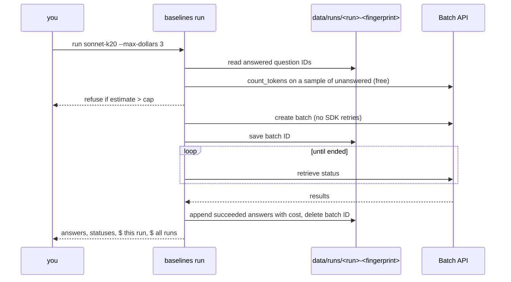

# M1: Batch API runner, budget guard and cost estimate

**PR:** [reflective-qa#9](https://github.com/bhavya94/reflective-qa/pull/9) · **Code at:** [`3440bb8`](https://github.com/bhavya94/reflective-qa/tree/3440bb89960268bf12e100a285d56eac9cd7d2f2)

## Summary
The project has a $20 API budget for M1 to M4, so every paid call must count. This PR runs a config over a
fixed, seeded sample of 200 text-only dev questions through the Message Batches API, which costs half the
normal price. Every answer is saved with its cost. A rerun never pays for a question twice, answers from
different setups never mix, and `run` refuses to submit when the estimate is over a dollar cap. A free
`estimate` command counts real input tokens: all three M1 baselines come to about $2.00 at the assumed 500
output tokens per answer.

## In plain words
1. **Batch API:** we send all questions of a run as one job and collect the answers when it ends, usually
   within an hour. It costs 50% less than calling the model one question at a time.
2. **Never pay twice:** answered questions are skipped. The job's ID is saved before waiting, so if the
   computer sleeps or the program stops, the next run picks up the same job instead of submitting a new one.
3. **Never mix setups:** each run's files are named with a fingerprint of its model, settings, prompt and
   schema. Change any of them, and answers go to a new file.
4. **Budget guard:** before submitting, the runner counts the input tokens of exactly the unanswered questions
   (free) and stops if the estimate is over `--max-dollars`.
5. **Sample:** 200 questions instead of 841 keeps M1 near $2. A 20-question pilot is the first 20 of the same
   200, so its answers count toward the full run.

## How it works

- **Sample** ([`src/reflective_qa/baselines.py:55-59`](https://github.com/bhavya94/reflective-qa/blob/3440bb89960268bf12e100a285d56eac9cd7d2f2/src/reflective_qa/baselines.py#L55-L59)): a seeded shuffle cut to n, so smaller samples are
  prefixes of larger ones.
- **Fingerprint** ([`baselines.py:45-52`](https://github.com/bhavya94/reflective-qa/blob/3440bb89960268bf12e100a285d56eac9cd7d2f2/src/reflective_qa/baselines.py#L45-L52)): a hash of the run config, system prompt and schema in every file name.
- **Run** ([`baselines.py:80-106`](https://github.com/bhavya94/reflective-qa/blob/3440bb89960268bf12e100a285d56eac9cd7d2f2/src/reflective_qa/baselines.py#L80-L106)): the batch is created with retries off ([`baselines.py:95`](https://github.com/bhavya94/reflective-qa/blob/3440bb89960268bf12e100a285d56eac9cd7d2f2/src/reflective_qa/baselines.py#L95)), and its ID is saved before waiting
  ([`baselines.py:96`](https://github.com/bhavya94/reflective-qa/blob/3440bb89960268bf12e100a285d56eac9cd7d2f2/src/reflective_qa/baselines.py#L96)). Only succeeded results are written, and never twice ([`baselines.py:101`](https://github.com/bhavya94/reflective-qa/blob/3440bb89960268bf12e100a285d56eac9cd7d2f2/src/reflective_qa/baselines.py#L101)), so errored or expired requests retry
  on the next run.
- **Estimate** ([`baselines.py:116-132`](https://github.com/bhavya94/reflective-qa/blob/3440bb89960268bf12e100a285d56eac9cd7d2f2/src/reflective_qa/baselines.py#L116-L132)): input tokens are counted on up to 50 evenly spaced questions. Output tokens are
  the run's measured mean once it has answers, else the configured 500.
- **Guard** ([`baselines.py:165`](https://github.com/bhavya94/reflective-qa/blob/3440bb89960268bf12e100a285d56eac9cd7d2f2/src/reflective_qa/baselines.py#L165)): skipped only when resuming a batch that has already been paid for.

## Files

| File | Why |
|---|---|
| `src/reflective_qa/baselines.py` | Sampling, batch run with cache, estimate, budget guard, command line |
| `configs/answering.toml` | Prices, batch discount, assumed output tokens, sample size and seed |
| `tests/test_baselines.py` | A fake Batch API: interrupt and resume, no duplicate answers, a changed config, failed requests, costs. Each money guarantee fails its test when broken (checked by breaking each one) |

## Decision log

| Decision | Options considered | Chosen | Why | Revisit if |
|---|---|---|---|---|
| How to call the model | One request at a time; Batch API | Batch API | Half price, and no rate-limit handling. Results take minutes to an hour | We need answers interactively, as in M3's critic loop |
| Cache key | Run name; run name + fingerprint | Fingerprint | Run name alone let a smoke test's answers mix with a later config's, and labeled Haiku answers as Sonnet. Caught in review | — |
| SDK retries on create | Default (2); off | Off | A retried create whose first response was lost submits a second paid batch. After a failed create, check `batches.list()` before rerunning | The API adds idempotency keys for batches |
| Question set | All 841; 200 sampled | 200, seed 0, shared by M1–M4 | $20 total budget; M2 reads about 100 outputs and M4 uses about 100 questions | The budget grows |

## Cost & risk
- Free estimate for the 200-question sample: Sonnet with 20 paragraphs ≈ $1.36, closed-book ≈ $0.60, Haiku
  with 5 ≈ $0.04, about $2.00 together. If reasoning runs to 1,500 output tokens per answer, about $4.
- Output tokens are the main unknown. A 20-question pilot (about $0.20) replaces the assumption with a
  measurement before the full runs.
- Prices in `configs/answering.toml` are copied from Anthropic's list (2026-10-06). If they change, the
  estimates are wrong until the file is updated.

## Open questions
1. Approval for the 20-question pilot (about $0.20), then the full 200-question runs under a cap you set.
