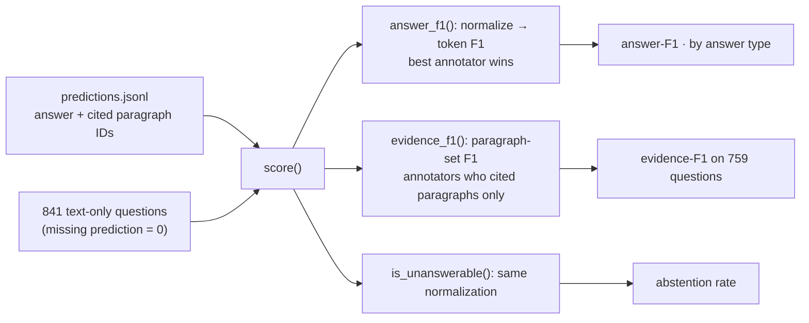

# M1: answer-F1 and paragraph-ID evidence-F1

**PR:** [reflective-qa#7](https://github.com/bhavya94/reflective-qa/pull/7) · **Code at:** [`621e25c`](https://github.com/bhavya94/reflective-qa/tree/621e25cc5dcd231cdc65c5c2f0bfd7b4db6f333f)

## Summary
Every later experiment compares answers by score, so the score must be right before any model runs. This PR
scores predictions on the 841 text-only dev questions. Answer-F1 matches the official QASPER evaluator exactly.
Evidence-F1 is our own metric: it checks whether the model cited the right paragraphs. Floor baselines show what
a real model must beat: always answering "Unanswerable" scores answer-F1 0.139, and always "Yes" scores 0.067.

## In plain words
1. **Answer-F1** compares the words of the model's answer with each annotator's answer. Before comparing, it
   lowercases the text and removes punctuation and "a", "an", "the". The best match over annotators counts.
2. **Abstention rate** is the share of answers that say "Unanswerable". A reflection agent can learn to abstain
   too often, so we track it on every run.
3. **Evidence-F1** compares the paragraph IDs the model cites with the IDs an annotator cited. It only scores
   questions where some annotator cited a paragraph, so citing nothing can never score.

## How it works

- **Normalization** ([`src/reflective_qa/scoring.py:29-35`](https://github.com/bhavya94/reflective-qa/blob/621e25cc5dcd231cdc65c5c2f0bfd7b4db6f333f/src/reflective_qa/scoring.py#L29-L35)): lowercase, remove punctuation, remove articles,
  collapse whitespace, in the official evaluator's order.
- **Answer-F1** ([`scoring.py:47-50`](https://github.com/bhavya94/reflective-qa/blob/621e25cc5dcd231cdc65c5c2f0bfd7b4db6f333f/src/reflective_qa/scoring.py#L47-L50)): token F1 against every annotator's answer; the best one counts, and the first one
  wins a tie, as in the official evaluator.
- **Evidence-F1** ([`scoring.py:53-59`](https://github.com/bhavya94/reflective-qa/blob/621e25cc5dcd231cdc65c5c2f0bfd7b4db6f333f/src/reflective_qa/scoring.py#L53-L59)): F1 between the cited and gold paragraph sets, best annotator, counting only
  annotators who cited paragraphs. A repeated citation counts once.
- **Abstention** ([`scoring.py:62-64`](https://github.com/bhavya94/reflective-qa/blob/621e25cc5dcd231cdc65c5c2f0bfd7b4db6f333f/src/reflective_qa/scoring.py#L62-L64)): "unanswerable." and " Unanswerable " both count, because they use the same
  normalization as answer-F1.
- **Totals** ([`scoring.py:67-87`](https://github.com/bhavya94/reflective-qa/blob/621e25cc5dcd231cdc65c5c2f0bfd7b4db6f333f/src/reflective_qa/scoring.py#L67-L87)): all 841 questions count for answer-F1, and a question with no prediction scores 0.

## Floor baselines (dev)

| Predictor | Answer-F1 | Evidence-F1 | Abstains |
|---|---|---|---|
| Always "Unanswerable" | 0.139 | 0.000 | 100% |
| Always "Yes" | 0.067 | 0.000 | 0% |
| First annotator's own answer (sanity check) | 1.000 | 0.957 | 10.1% |

The sanity check's evidence-F1 is below 1 because it cites nothing when its annotator abstained but another
annotator cited a paragraph.

## Files

| File | Why |
|---|---|
| `src/reflective_qa/scoring.py` | The metrics, a JSON lines loader, and a command-line report |
| `tests/test_scoring.py` | Normalization, best-annotator choice, evidence rules, abstentions, missing predictions |
| `tests/test_evaluator_parity.py` | Answer-F1, per-type F1 and missing count equal the official evaluator's on dev, across nine prediction styles |
| `README.md` | Adds the scoring command |

## Decision log

| Decision | Options considered | Chosen | Why | Revisit if |
|---|---|---|---|---|
| Answer-F1 | Own metric; the official evaluator's | The official, reimplemented and checked by a parity test | Results stay comparable with published QASPER answer-F1. Importing the downloaded evaluator into package code would make the package depend on an unversioned script | — |
| Which questions count | The official file; the 841 text-only questions | Text-only | The official evaluator scores every question in the file, so questions outside our working set would count as zeros | We add figure and table questions |
| Evidence-F1 | Official (raw evidence strings); paragraph IDs over all annotators; paragraph IDs over annotators who cited paragraphs | The last | Raw strings miss 77 whitespace variants. Counting evidence-free annotators let a model score by citing nothing: 156 of 841 questions have such an annotator. Caught in review | — |
| Abstention match | Exact string; normalized | Normalized | Models often write "Unanswerable." with a period. Exact matching counted 5% abstentions when the true rate was 50% in review | — |

## Cost & risk
- No model calls. Scoring all 841 questions takes under a second.
- Evidence-F1 can't be compared with published QASPER evidence-F1. The command-line report says so.
- 82 of 841 questions have no cited paragraph at all, so evidence-F1 covers 759 questions.

## Open questions
None for this PR.
